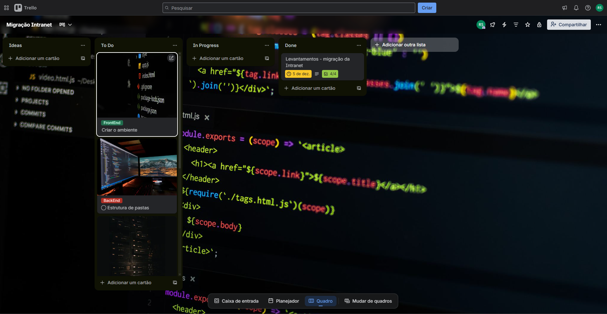

# _Intranet rsd Migração_

Migrando a página de Intranet, onde estava com CSS, PHP, JS e MySQL. Deixando ela separada com o FrontEnd (React), BackEnd (Node.Js), conectada com o Banco de Dados MySQL pelo (Docker) e a identidade visual utilizando Tailwind . O repositório anteriro está no seguinte link [Intranet Antiga](https://github.com/Rodrigo-Sousa/intranet-rsd).

Este repositório contempla a nova versão, no qual tem como base o repositório retromencionado, mas visando a melhor separação de cada parte do código, com reutilização de alguns trechos, deixando de forma menos verbosa. Cada etapa foi devidamente separada e contém seu repositório específico para auxiliar melhor na compreensão do que foi realizada em cada momento do desenvolvimento e na raiz, o projeto compilado pronto para execução.

## Motivo da migração

Descrever e demostrar _passo a passo_ na migração do repositório **intranet-rsd** para uma arquitetura moderna, utilizando **Frontend React** (componetização, otimizado, Tailwind) e **Backend Node.js** organizado (API REST, boas práticas, DB para o canal confidencial).

1. Criar o ambiente. 
2. Estruturar pastas. 
3. Criptografando/armazenando mensagens confidenciais.
4. Testes, CI/CD
5. Criação do Diagrama (caso de uso, fluxograma/sequência e UML de classes).

Utilizando a ferramenta _Trello_ para acompanhar as etapas de entrega do projeto, com a descrição do que será feito em cada etapa.

## Planejamento

1. Separar front e back em dois projetos.
2. Front: React com componentização, Talwind para estilos.
3. Back: Node.js + Nest.js, API REST.
4. Persistência: PostgreSQL auxiliando o Canal Confidencial.
5. Boas práticas: organização em camadas (routes -> controllers -> services -> repositories), validação, autenticação, logs, teste, CI.